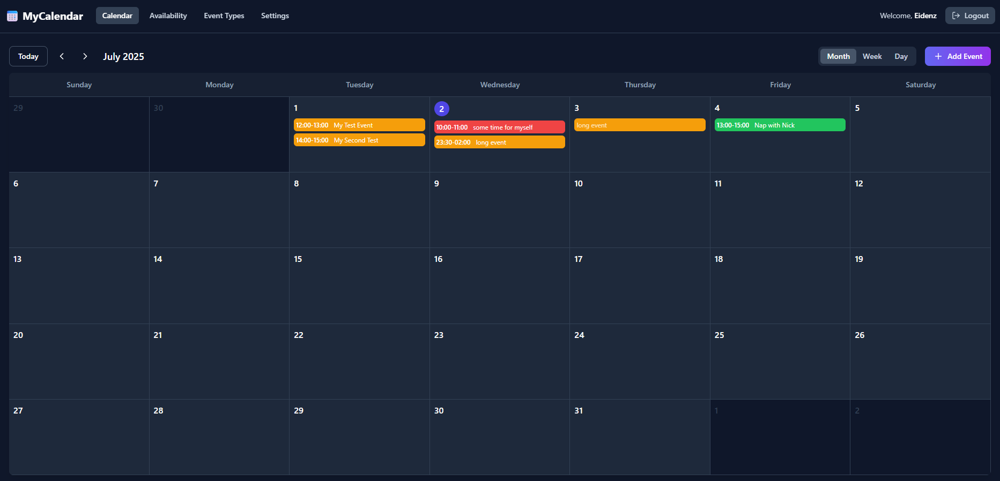
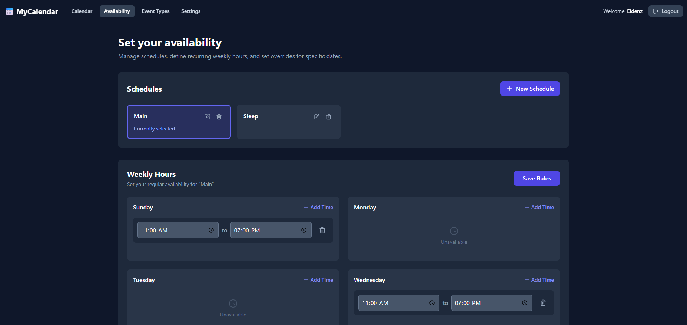
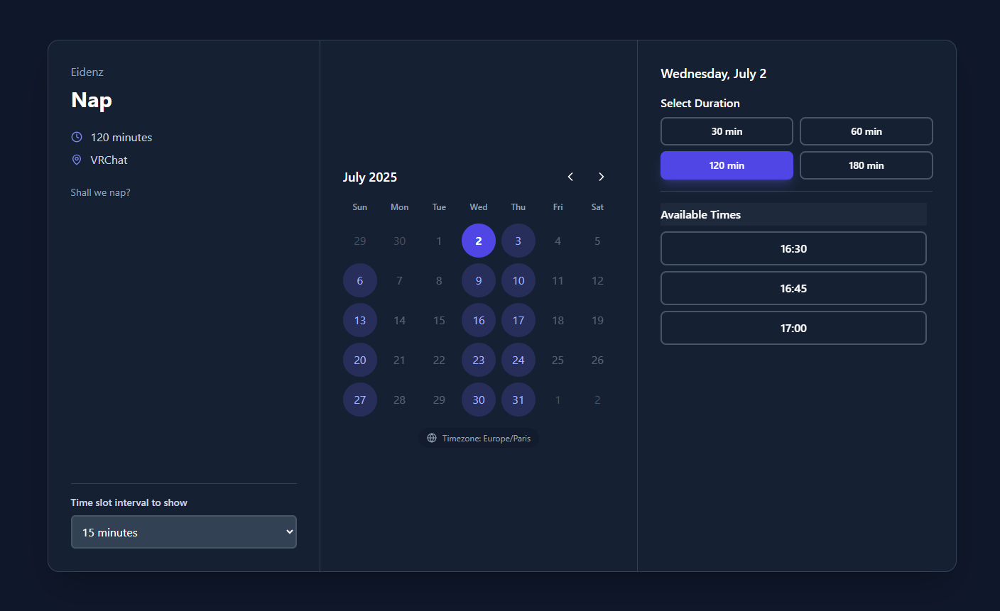

# MyCalBook 📅

MyCalBook is a modern, open-source scheduling and calendar application designed to be a self-hostable alternative to services like CalCom. It allows users to manage their availability, create different types of bookable events, and share public links for others to schedule appointments.

## ✨ Screenshots







## ✨ Key Features

*   **User Authentication**: Secure user registration and login system using JWT.
*   **Dynamic Calendar**: A full-featured calendar with month, week, and day views.
*   **Event Management**: Create personal events or block out time directly on the calendar.
*   **Advanced Availability**:
    *   Create multiple availability schedules (e.g., "Work Hours", "Weekends").
    *   Define recurring weekly hours for each schedule.
    *   Set date-specific overrides for holidays, vacations, or special events.
*   **Bookable Event Types**:
    *   Create different event types (e.g., "30-Min Meeting", "1-Hour Consultation").
    *   Customize event duration, location, and description.
    *   Toggle events between public and private visibility.
*   **Public Booking Pages**:
    *   A personal profile page (`/u/:username`) lists all public event types.
    *   Each event type has a unique booking page (`/book/:slug`).
    *   The booking interface intelligently shows available slots based on the owner's availability and existing events.
*   **Email Notifications**: Automatic email confirmations and cancellations for both the event owner and the booker (powered by Nodemailer).
*   **User Settings**: Users can manage their password and notification preferences.
*   **Responsive Design**: A clean, modern UI that works on both desktop and mobile devices.

## 🛠️ Technology Stack

The project is a monorepo with a separate frontend and backend.

### Backend (in `/server`)

*   **Runtime**: [Node.js](https://nodejs.org/)
*   **Framework**: [Express.js](https://expressjs.com/)
*   **Database**: [SQLite3](https://www.sqlite.org/) (for simplicity and portability)
*   **Database Query Builder**: [Knex.js](https://knexjs.org/)
*   **Authentication**: [JSON Web Tokens (JWT)](https://jwt.io/)
*   **Password Hashing**: [bcrypt.js](https://github.com/dcodeIO/bcrypt.js)
*   **Emailing**: [Nodemailer](https://nodemailer.com/)
*   **Environment Variables**: [dotenv](https://github.com/motdotla/dotenv)

### Frontend (in `/client`)

*   **Framework**: [React](https://reactjs.org/)
*   **Build Tool**: [Vite](https://vitejs.dev/)
*   **Routing**: [React Router](https://reactrouter.com/)
*   **Styling**: [Tailwind CSS](https://tailwindcss.com/)
*   **Date Management**: [date-fns](https://date-fns.org/)
*   **Icons**: [Lucide React](https://lucide.dev/)

---

## 🚀 Getting Started

Follow these instructions to get the application running on your local machine for development and testing purposes.

### Production Build & Deployment (Docker)

The project is configured for easy deployment with Docker.

1.  **Create your production `.env` file:**
    ```sh
    cp .env.example .env
    ```

2.  **Edit the `.env` file:**
    -   Set a very long, secure, random string for `JWT_SECRET`.
    -   Configure the `MAIL_*` variables with your SMTP provider's credentials.

3.  **Build and run the container:**
    ```sh
    docker-compose up --build -d
    ```

The application will be running and accessible at `http://localhost:8080` (or whichever host port you configure in `docker-compose.yml`). The Docker entrypoint script will automatically run database migrations on container startup.

Data is persisted in volumes defined in `docker-compose.yml`, so your database will be safe across container restarts.

## Development

### Prerequisites

*   [Node.js](https://nodejs.org/en/download/) (v18 or later recommended)
*   [npm](https://www.npmjs.com/get-npm) (comes with Node.js)

### Installation & Setup

1.  **Set up the Backend:**
    ```bash
    cd server
    npm install
    ```
    *   Create an environment file by copying the example:
        ```bash
        cp .env.example .env
        ```
    *   Open the new `.env` file and fill in the required values. A strong, randomly generated `JWT_SECRET` is crucial for security.
        ```dotenv
        # Server Configuration
        PORT=5001

        # Security
        JWT_SECRET=your_super_secret_and_long_jwt_key

        # Email Configuration (Example for Ethereal)
        EMAIL_HOST=smtp.ethereal.email
        EMAIL_PORT=587
        EMAIL_USER=your_ethereal_user@ethereal.email
        EMAIL_PASS=your_ethereal_password
        ```
    *   Set up the database. The following commands will create the `mycalbook.sqlite3` file and run all the necessary schema migrations.
        ```bash
        npm run db:migrate
        # (Optional) To populate with initial sample data:
        # npm run db:seed
        ```

2.  **Set up the Frontend:**
    ```bash
    cd ../client
    npm install
    ```

### Running the Application

You will need to run the backend and frontend servers in two separate terminals.

1.  **Start the Backend Server:**
    *   Navigate to the `/server` directory.
    *   Run the development server, which will automatically restart on file changes.
    ```bash
    cd server
    npm run dev
    ```
    🚀 The backend API will be running on `http://localhost:5001`.

2.  **Start the Frontend Server:**
    *   Navigate to the `/client` directory.
    *   Run the Vite development server.
    ```bash
    cd client
    npm run dev
    ```
    🎨 The frontend application will be available at `http://localhost:5173`. The Vite server is configured to proxy API requests from `/api` to the backend server.

---

## Project Structure

```
.
├── client/
│   ├── public/         # Static assets
│   ├── src/
│   │   ├── components/ # Reusable React components
│   │   ├── context/    # React context (e.g., AuthContext)
│   │   ├── hooks/      # Custom hooks (e.g., useCalendar)
│   │   ├── pages/      # Page components for React Router
│   │   ├── App.jsx     # Main App component with routing
│   │   └── main.jsx    # Entry point for the React app
│   ├── package.json
│   └── vite.config.js  # Vite configuration (including API proxy)
│
└── server/
    ├── db/
    │   ├── migrations/ # Knex database migrations
    │   ├── seeds/      # Knex database seeds
    │   └── knex.cjs    # Knex database connection
    ├── middleware/
    │   └── auth.cjs    # JWT authentication middleware
    ├── routes/         # Express API route definitions
    ├── services/       # Business logic (e.g., emailService)
    ├── .env.example    # Example environment variables
    ├── index.cjs       # Main Express server entry point
    └── package.json
```

## 📜 License

This project is licensed under the MIT License. See the `LICENSE` file for details.