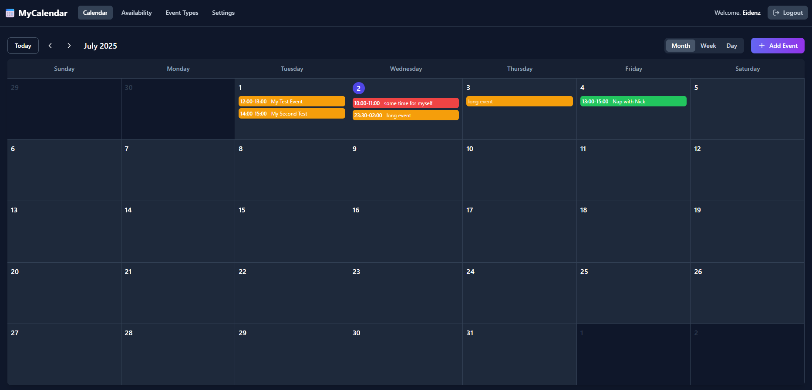

# MyCalBook Plasma 6 Widget

A KDE Plasma 6 desktop/panel widget that shows upcoming events from a
self-hosted [MyCalBook](../) instance.



## Features

- Compact panel representation with a calendar icon and a badge showing
  the number of events scheduled for today.
- Full popup view with upcoming events grouped by day (`Today`, `Tomorrow`,
  weekday names, then full dates).
- Coloured stripes distinguish personal events from confirmed bookings and
  blocked time.
- Authenticates with a **persistent API key** generated in your MyCalBook
  user settings — no JWT expiry issues.
- Configurable server URL, refresh interval, max events to show, and
  whether all-day events are included.
- Wayland-friendly (pure QML, no X11 dependencies).

## Requirements

- KDE Plasma **6** (Qt 6 / KF 6)
- A reachable MyCalBook server (local or remote)
- `kpackagetool6` (ships with Plasma 6 — already present on Nobara KDE)

## Install

From this directory:

```bash
./install.sh
```

That installs the package via `kpackagetool6` into your local Plasma
applet directory (`~/.local/share/plasma/plasmoids/org.eidenz.mycalbook`).
Re-running `./install.sh` upgrades an existing install in place.

If the widget doesn't appear in *Add Widgets…* immediately, restart
plasmashell:

```bash
kquitapp6 plasmashell && kstart plasmashell
```

To uninstall:

```bash
./install.sh remove
```

## Configure

1. In MyCalBook, open **Settings → API Keys** and generate a new key
   (e.g. `KDE Desktop Widget`). Copy the full `mcb_…` value — it's only
   shown once.
2. Add the widget to your panel or desktop via *Add Widgets…* → search
   for *MyCalBook*.
3. Right-click the widget → **Configure MyCalBook Upcoming Events…**
4. Fill in:
   - **Server URL** — base URL of your MyCalBook instance
     (e.g. `https://cal.example.com` or `http://localhost:5001`)
   - **API key** — the `mcb_…` value you copied
   - **Max events** — how many upcoming events to show in the popup
   - **Refresh interval** — minutes between background refreshes
   - **All-day events** — toggle whether all-day items appear

The widget refreshes immediately after any config change.

## How it talks to MyCalBook

It calls `GET /api/events/manual?month=YYYY-MM` for the current month and
the next month, then merges, dedupes by id, filters out anything that has
already ended, and sorts the result. Authentication uses the
`x-api-key` header (the same persistent token system the server exposes
to any third-party integration).

## Files

```
plasmoid/
├── install.sh                       # kpackagetool6 install/uninstall helper
├── README.md
└── package/
    ├── metadata.json                # Plasma 6 plasmoid metadata
    └── contents/
        ├── config/
        │   ├── config.qml           # Config dialog tab definitions
        │   └── main.xml             # Persisted config schema (kcfg)
        └── ui/
            ├── main.qml             # PlasmoidItem root, fetch state, timer
            ├── CompactView.qml      # Panel icon + today badge
            ├── FullView.qml         # Popup: grouped upcoming events list
            └── mycalbook.js         # API fetch + grouping helpers
```

## Troubleshooting

- **"API key rejected (401)"** — the key has been revoked or copied
  incorrectly. Generate a new one in *Settings → API Keys*.
- **"Could not reach server"** — the server URL is wrong or the server is
  not running. The URL must include the scheme (`http://` or `https://`).
- **Nothing happens after install** — restart plasmashell as shown above.
  Plasma caches plasmoid metadata between launches.
- **Widget shows but no events** — open the popup; configure the server
  URL and API key via the gear/configure button if you skipped it.
